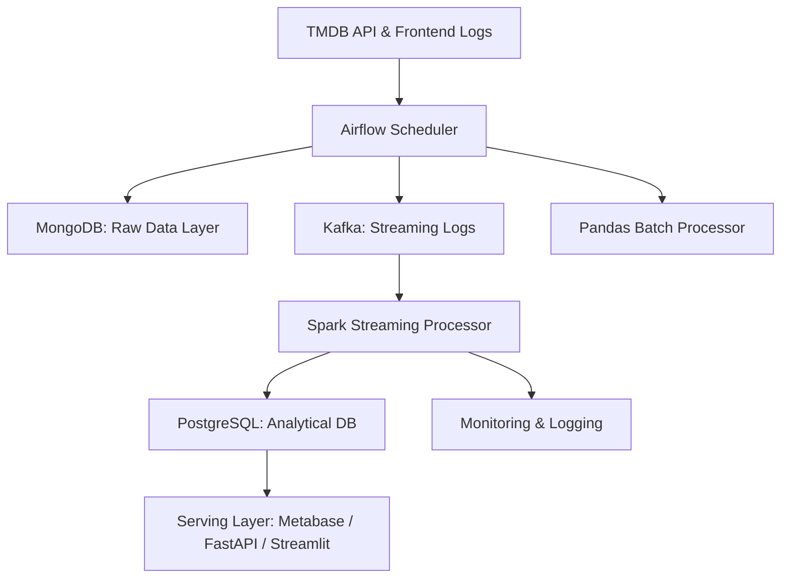

# 🎬 Movie Review Web Application - Data Pipeline Design Document

---

## ✨ Overview

This document details the end-to-end design of the data pipeline for the movie review web application. It covers data flow, ingestion, staging, modeling, serving, and analytics, with clear responsibilities, technology choices, and rationale for each layer. The goal is to ensure any team member can understand, contribute, or troubleshoot the system effectively.

## 🔄 Data Flow: From Source to Serving

**1. Data Sources:**
- **TMDB API**: Provides movie metadata (title, genres, companies, etc.).
- **Frontend (Web/App)**: Sends user interactions (watch, rate, comment, click, etc.).

**2. Ingestion:**
- **Airflow** schedules and orchestrates batch jobs to fetch movie data from TMDB API.
- **Frontend** pushes user logs in real-time to **Kafka** topics.

**3. Staging:**
- **MongoDB** stores raw JSON data from TMDB and raw user logs as backup and for semi-structured access.
- **Kafka** acts as a buffer and streaming backbone for real-time user events.

**4. Processing & Modeling:**
- **Spark Streaming** consumes Kafka topics, cleans, transforms, and enriches data in (near) real-time.
- **Pandas** batch jobs process data for movie data

**5. Storage:**
- **PostgreSQL** stores structured, relational, and analytical data (star schema: fact & dimension tables).

**6. Serving:**
- **Metabase** for internal dashboards and analytics.
- **FastAPI** for RESTful APIs serving frontend and external clients.
- (Optionally) **Streamlit** or other tools for ad-hoc data exploration.

**7. ML Model:**
- Trains on data from PostgreSQL (ratings, watch history, user events).
- Outputs recommendations or analytics, which are served via API or dashboard.

---

## ❓ Why These Technologies?

### Why Kafka? Why not just MongoDB?

- **Kafka** is designed for high-throughput, real-time streaming and decoupling producers (frontend) from consumers (processing jobs). It provides durability, scalability, and replayability of events.
- **MongoDB** is great for storing raw, semi-structured data, but lacks native streaming, ordering, and consumer group semantics needed for robust real-time pipelines.
- **Kafka** enables real-time analytics, event-driven processing, and fault-tolerant ingestion, which MongoDB alone cannot provide.

### Why Spark? Real-time or Just-in-time Batch?

- **Spark Streaming** is used to process user events and movie data in (near) real-time, enabling timely analytics, recommendations, and dashboard updates.
- Real-time is needed for features like live user stats, trending movies, and up-to-date recommendations.
- **Batch (Pandas)** is used as a fallback for reliability, or for heavy offline processing (e.g., nightly jobs, data backfills).

### Why Backup to MongoDB?

- **MongoDB** acts as a backup for all raw data (both movie metadata and user logs), ensuring data is not lost if downstream systems fail.
- It allows for flexible reprocessing, debugging, and supports use cases where raw, unstructured data is needed (e.g., data science exploration).

### Why Use PostgreSQL for Querying?

- **PostgreSQL** provides strong consistency, relational modeling, indexing, and SQL analytics capabilities.
- It is optimized for complex queries, aggregations, and supports BI tools and ML pipelines.
- Star schema design enables fast analytical queries and easy integration with dashboarding tools.

---

## ⚙️ Architecture Overview

---

## 🚀 Ingestion Layer

### Responsibilities

- **Airflow**: Schedules daily/hourly jobs to fetch movie data from TMDB API and orchestrates batch ETL.
- **Frontend**: Sends user events (watch, rate, comment, etc.) to Kafka in real-time.
- **Backup**: All ingested data is also stored in MongoDB for redundancy and raw access.

### Tools

- Airflow, Python (requests, schedule), Kafka, MongoDB

### Design Notes

- Kafka topics: `click`, `rating`, `trailer`, `search`, `dwelltime` 
- Airflow DAGs manage jobs.

---

## 🗂 Staging Layer

### Responsibilities

- Store raw and semi-structured data for reliability and reprocessing.
- Ensure data availability even if downstream systems are down.

### Tools

- MongoDB (raw backups)
- PostgreSQL (staging tables for ETL)

### Structure

- MongoDB: `raw.movies`, `raw.user_logs`
- PostgreSQL: `stg_movies`, `stg_user_logs`, `stg_comments`

---

## 💡 Modeling & Processing Layer

### Responsibilities

- Clean, enrich, and transform data for analytics and ML.
- Support both streaming (real-time) and batch pipelines.

### Streaming (Primary)

- **Spark Streaming** reads from Kafka, processes events, and writes to PostgreSQL fact/dimension tables.
- Enables near real-time analytics, dashboards, and recommendations.

### Batch 

- **Pandas** batch jobs process data from MongoDB to nomalize, process missing data, duplicate, etc.
- Used for nightly jobs.

### Consistency Design

- All modeling tables include a `source_flag` column to track data origin (spark, pandas, etc.).
- Business logic is centralized in `transform_rules.json` for consistency across tools.

---

## 🏠 Serving Layer

### Responsibilities

- Expose processed data for analytics, dashboards, and APIs.

### Tools

- **Metabase**: Internal dashboards for business and technical users.
- **FastAPI**: RESTful API endpoints for frontend and external clients.
- **Streamlit** (optional): For rapid prototyping and ad-hoc data exploration.

### Planned API Endpoints

- `/api/top_movies`
- `/api/user_stats`
- `/api/emotion_trends`
- `/api/recommendations` (from ML model)

---

## 🤖 ML Model Integration

- **Data Source**: ML models train on data from Spark after enrichment with PostgreSQL data (ratings, watch history, user events, etc.).
- **Serving**: Model outputs (e.g., recommendations) are exposed via FastAPI endpoints or visualized in Streamlit.
- **Consumers**: Frontend apps, dashboards, or other services can consume recommendations or analytics.

---

## 🔧 Future Improvements

- Introduce **dbt** for unified modeling and testing.
- Replace Pandas fallback with Spark batch jobs for consistency.
- Use **Great Expectations** for data quality validation.
- Build data audit and lineage layer using Airflow metadata.
- Integrate more advanced ML models and real-time serving.

---

## 📅 Team Responsibilities

| Role                | Responsibilities                                      |
|---------------------|-------------------------------------------------------|
| Data Engineer       | Maintain Airflow, Kafka, Spark jobs, data quality     |
| FullStack Developer | Build UI & monitor FastAPI endpoints                  |
| ML Engineer         | Use Metabase/SQL for data exploration & ML pipelines  |
| All Members         | Follow schema & transformation specifications         |

---

## 🌟 Glossary

- **Fact Table**: Stores measurable, transactional data (e.g., watch duration).
- **Dimension Table**: Stores descriptive attributes (e.g., movie genre).
- **Source Flag**: Column to track data origin (spark, pandas, etc.).
- **Serving Layer**: APIs and dashboards that expose processed data to users.

---

**Version:** 1.2  
**Last Updated:** 2025-07-24